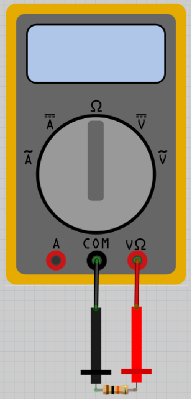
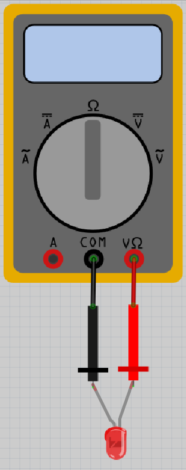

# Lektion 2: Användning av en multimeter

Under den här lektionen ska vi använda en multimeter.

 | Ingen spaning, ingen aning!
:-------------:|:----------------------------------------: 

## 2.1. Mätning av inget motstånd

Leta efter en multimeter och två tillhörande mätkablar: en röd och en svart.
Vrid knappen på multimetern till Ohm symbolen (ser ut så här: Ω),
och om det står nummer så ska du ha 20K.
Koppla in den röda mätkabeln i det röda hålet på multimetern som har ett V och en
Ohm symbol (Ω) ovanför sig.
Koppla in den svarta mätkabeln i det svarta hålet på multimetern som har ordet 'COM' ovanför sig.

Sätt på multimetern och håll ihop den röda och svarta mätpinnen.
Vad visar mätningen?

### Svaret

Skärmen ska visa ett motstånd på 0 Ohm.

Ett motstånd på 0 Ohm betyder att det inte finns någonting emellan mätpunkterna.
Det stämmer: el kan gå från ena mätpunkten till den andra utan motstånd.

 | En motstånd på 0 Ohm kallas också för kortslutning!
:-------------:|:----------------------------------------: 

## 2.2. Mätning av oändligt motstånd

Sätt på multimetern och håll den röda mätpinnen långt bort från den svarta mätpinnen.
Vad visar mätningen?

### Svaret

Skärmen skulle visat 'Inf' eller 'OL'. 'Inf' är an förkortning av 'Infinity',
som är engelska för oändligt.

Det betyder att det finns oändligt mycket motstånd mellan mätpinnarna.
Det stämmer: el kan gå från ena mätpinnen till den andra med mycket motstånd!
Det är svårt för el att gå igenom luften!

 | Ett oändligt motstånd indikerar strömavbrott.
:-------------:|:----------------------------------------: 

## 2.3. Mätning av ett tusenohms motstånd

Leta efter ett 1000 ohms motstånd.
Det har ränder i brunt, svart, röd och guld, i den ordningen.

Sätt på multimetern och koppla:

 * röda mätpinnen till motståndet på sidan med en brunt rand 
 * svarta mätpinnen till andra sidan av motståndet

Vad visar mätningen?

### Svaret

Värdena skulle vara mellan 950 och 1050 Ohm! (du måste multiplicera det multimetern visar med 1000 ibland)
Motstånd är inte perfekta, så det stämmer!

 | Motstånd är inte perfekta!
:-------------:|:----------------------------------------: 

## 2.4. Mätning av ett 100 Ohms motstånd i andra riktningen

Vänd på motståndet och mät motståndet igen:

 * röda mätpinnen på sidan med guldrand på motståndet
 * svarta mätpinnen på andra sidan av motståndet

Vad visar mätningen?

### Svaret

Värdena skulle vara mellan 950 och 1050 Ohm!
Riktningen på motståndet spelar ingen roll.

 | Riktningen på motståndet spelar ingen roll!
:-------------:|:----------------------------------------: 

## 2.5. Mätning av ett 10 000 Ohms motstånd

Leta efter ett **10**-1000 Ohms motstånd.
Det har ränder i brunt, svart, **orange** och guld, i den ordningen.

Sätt på multimetern och koppla:

 * röda mätpinnen till motståndet, på sidan med brun rand 
 * svarta mätpinnen till andra sidan av motståndet

Vad visar mätningen?

### Svaret

Värdena skulle vara mellan 9 500 och 10 500 Ohm!
Motstånd är inte perfekta, så det stämmer!

 | Motstånd är inte perfekta!
:-------------:|:----------------------------------------: 

## 2.6. Mätning av ett 10 000 Ohms motstånd i andra riktning

Vänd på motståndet och mät motståndet igen:

 * röda mätpinnen på motståndet, på sidan med guldigt band 
 * svarta mätpinnen på andra sidan av motståndet

Vad visar mätningen?

### Svaret

Värdena skulle vara mellan 9 500 och 10 500 Ohm!
Igen, riktningen på motståndet spelar ingen roll.

 | Riktningen på motståndet spelar ingen roll!
:-------------:|:----------------------------------------: 

## 2.7. Mätning av en lysdiod

Leta efter en lysdiod.

Sätt på multimetern och koppla:

 * röda mätpinnen på det långa benet på lysdioden
 * svarta mätpinnen på det andra benet

Vad visar mätningen? Lyser lysdioden litegrann?

### Svaret

Värdet är inte oändligt!
Det betyder att el kan gå igenom en lysdiod.

Det är möjligt att lysdioden lyser litegrann!

 | Exakta motståndet hos en lysdiod spelar inte så stor roll
:-------------:|:----------------------------------------: 

## 2.8. Mätning av en lysdiod i andra riktningen

Vänd på lysdioden och mät motståndet igen:

 * röda mätpinnen på det kortare benet på lysdioden
 * svarta mätpinnen på det andra benet

Vad visar mätningen? Lyser lysdioden litegrann?

 | Riktningen på en lysdiod är viktigt!
:-------------:|:----------------------------------------: 

### Svaret

Värdet skulle vara oändligt.
Det betyder att el inte kan gå igenom en lysdiod i den riktningen.
Lysdioden lyser inte.

## 2.9. Slutuppgift

Hämta:

 * 1 st multimeter
 * 1 st 1000 Ohms motstånd
 * 1 st 10 000 Ohms motstånd
 * 1 st slumpmässigt motstånd
 * 1 st lysdiod

Läs igenom slutuppgiften först, för du har 5 minuter på dig.

1. Fråga någon för att få göra provet. Den personen får inte hjälpa dig.

Starta en timer och gör följande:

2. Visa exakta motståndet för ett 1.000 Ohms motstånd

3. Visa exakta motståndet för ett 10.000 Ohms motstånd

4. Visa exakta motståndet för det slumpmässigt valda motståndet

5. Bevisa att riktningen på en lysdiod är antingen viktig eller oviktig
