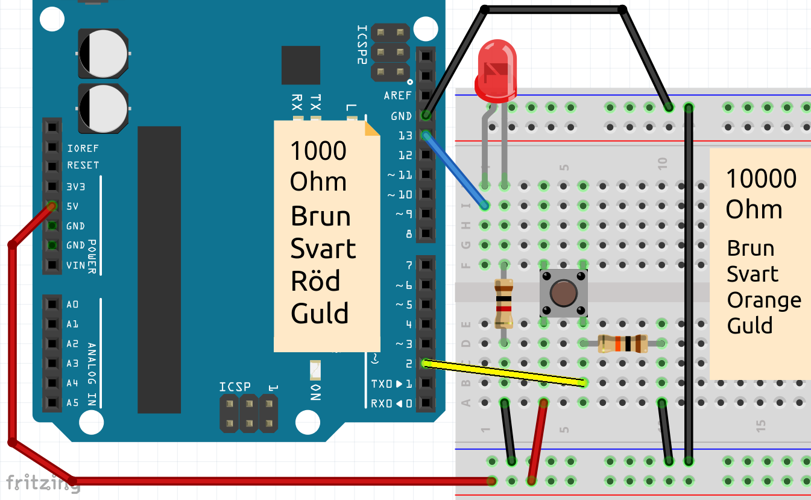
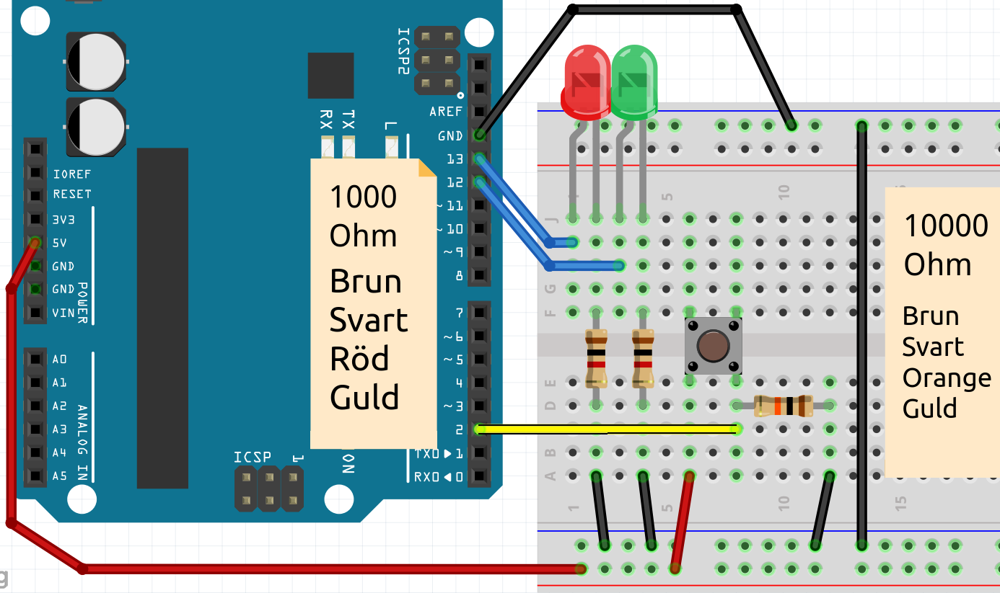

# Lektion 3: Knapp if ... else

I den här lektionen låter vi Arduino ställa frågor till sig själv.

 | Så Arduino blir en sorts filosof!
:-------------:|:----------------------------------------: 


## 3.1. Knapp if ... else: Anslut



 | Motståndet mot jord kallas ett 'Pull Down'-motstånd
:-------------:|:----------------------------------------: 

\pagebreak

## 3.2. Knapp if ... else: Kod

Här är koden för att få ljuset att tändas,
när knappen trycks in:

```c++
const int led_stift = 13;
const int knapp_stift = 2;

void setup() 
{
  pinMode(led_stift, OUTPUT);
  pinMode(knapp_stift, INPUT);
}

void loop()
{
  digitalWrite(led_stift, digitalRead(knapp_stift));
}
```


 | 
:-------------:|:----------------------------------------: 
`digitalRead(knapp_stift)` |'Ge mig `HIGH` om `knapp_stift` har spänning. Annars ge `LOW`'
`digitalWrite(led_stift, digitalRead(knapp_stift))`|'Sätt spänningen till `led_stift` om `knapp_stift` har spänning'

 | 'Pull Down'-motståndet ser till att stift 2 är anslutet till GND när knappen inte trycks in
:-------------:|:----------------------------------------: 

\pagebreak

## 3.3. Knapp if ... else: Fråga

När du trycker på knappen, släcks eller tänds lysdioden?

## 3.4. Knapp if ... else: Svara

Lysdioden tänds då.

 | Lysdioden tänds då
:-------------:|:----------------------------------------: 

## 3.5. Knapp if ... else: `if`

Med `if` kan du få Arduino att göra något, om något så här:

```c++
if (digitalRead(knapp_stift) == HIGH)
{
  digitalWrite(led_stift_rod, HIGH);
}
else
{
  digitalWrite(led_stift_gron, LOW);
}
```

Denna kod kontrollerar om det finns spänning på `knapp_stift`.
Om ja, lägg sedan Arduino spänning på `led_stift_red`.
Annars (`else`) tar Arduino spänningen från `led_stift_gron`.

 | 
:-------------:|:----------------------------------------: 
`if (digitalRead(knapp_stift) == HIGH) {}`|'Kära dator, om det finns spänning på `knapp_stift`, sätt den inom parentes'

 | `=` kan uttalas som "sätta på". "==" kan uttalas som "lika med"
:-------------:|:----------------------------------------: 

\pagebreak


## 3.6. Knapp if ... else: Uppgift 1

Detta är exempelkoden, som inte är helt färdig:

```c++
void setup() 
{

  pinMode(4, INPUT );
  pinMode(5, OUTPUT);
  pinMode(6, OUTPUT);
}


void loop()
{

  if (digitalRead(4) == HIGH)
  {
    digitalWrite(5, HIGH);
  }
  else
  {
    digitalWrite(6, LOW);
  }
}
```

Avsluta koden så att:

 * När du trycker på knappen tänds lampan
 * om du inte trycker på knappen slocknar lampan
 * använd variabler för att namnge stiften

 | Det finns inget semikolon efter de runda parenteserna för `if`.
:-------------:|:----------------------------------------: 

\pagebreak

## 3.7. Knapp if ... else: Lösning 1

```c++
// ...


void setup() 
{
  // ...
}


void loop()
{
  if (digitalRead(knapp_stift) == HIGH)
  {

    digitalWrite(led_stift, HIGH);
  }
  else
  {

    digitalWrite(led_stift, LOW);
  }
}
```

| `// ...` betyder 'koden du redan har där'
:-------------:|:----------------------------------------: 


## 3.8. Knapp if ... else: Uppgift 2

Anslut en andra grön lysdiod. Gör koden så att:

 * när du trycker på knappen tänds den första lampan och den andra lysdioden släcks
 * om du inte trycker på knappen slocknar den första lampan och den andra lysdioden slocknar
 * Namnge variabeln för stiftet på den röda lysdioden `led_stift_rod`, för
   grön LED `led_stift_gron`

| Du kan skriva flera rader inom de krulliga parenteserna av ett `if`. Precis som mellan hängslen i `setup` och `loop`!
:-------------:|:----------------------------------------: 

 | Glöm inte `else` ('annars')!
:-------------:|:----------------------------------------: 

\pagebreak

## 3.9. Knapp if ... else: Lösning 2

Bild `Lösning för 'Knapp med två lysdioder'` visar hur man ansluter detta.



Det här är koden:

```c++
const int led_stift_rod = 13;
const int led_stift_gron = 12;
// ...


void setup() 
{
  pinMode(led_stift_rod, OUTPUT);
  pinMode(led_stift_gron, OUTPUT);
  // ...
}


void loop()
{
  if (/* ... */)
  {
    digitalWrite(led_stift_gron, LOW);
    digitalWrite(led_stift_rod, HIGH);
  }

  else
  {
    digitalWrite(led_stift_gron, HIGH);
    digitalWrite(led_stift_rod, LOW);
  }
  delay(10);
}
```

\pagebreak

| `/* ... */` betyder också 'koden du redan har där'
:-------------:|:----------------------------------------: 

## 3.10. Knapp if ... else: Avsluta kommando

Anslut en andra knapp. Göra koden så att

  * om du trycker på den första knappen tänds den första lampan
  * om du inte trycker på den första knappen slocknar den första lampan
  * om du trycker på den andra knappen slocknar den andra lampan
  * om du inte trycker på den andra knappen tänds den andra lampan

| Du kan sätta `if` mer än en gång
:-------------:|:----------------------------------------: 


 | För en andra knapp behöver du ett andra motstånd på tio tusen ohm
:-------------:|:----------------------------------------: 


