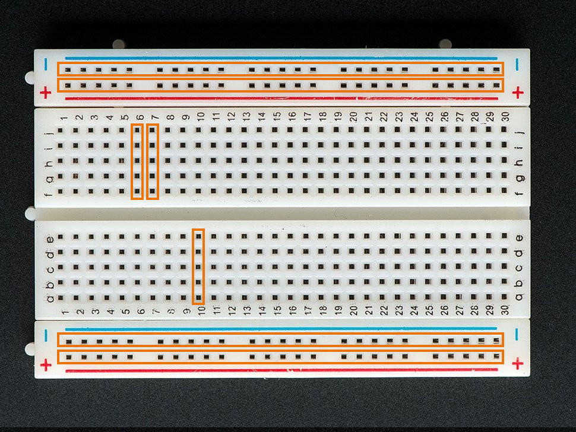
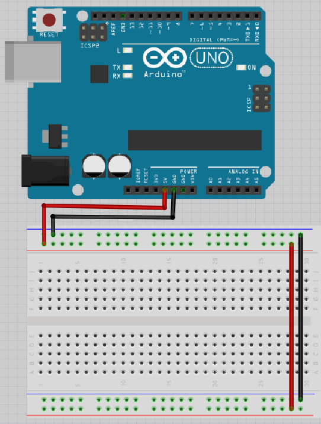
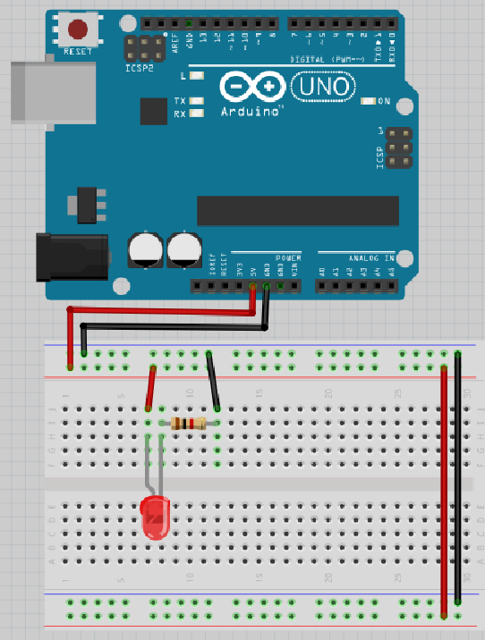
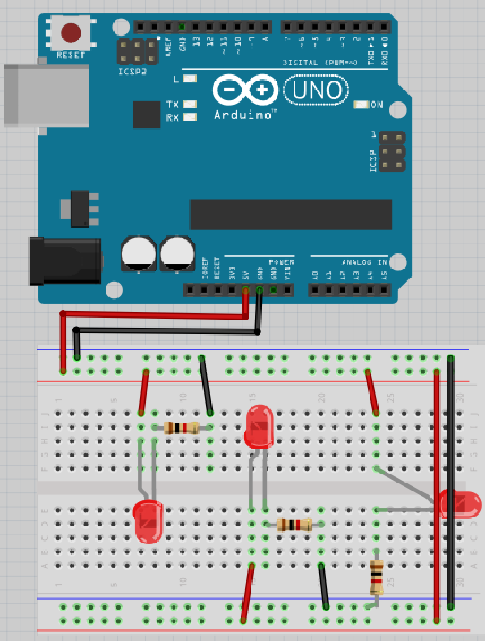

# Lektion 5: Anslutning av flera lysdioder

Under den här lektionen ska vi ansluta en lysdiod till en Arduino!

## 5.1. Kopplingsdäcket

Vi använder ett kopplingsdäck för att ansluta grejer till Arduino.

Här ser vi ett:

Och här är baksidan av samma kopplingsdäck:

Kom ihåg hur baksidan av kopplingsdäcket såg ut och titta på det här:

Vilka av hålen är sammanlänkade?

### Svar

 * 1 är sammanlänkat med 5
 * 2 är sammanlänkat med 6
 * 3 är sammanlänkat med 7
 * 4 är sammanlänkat med 8

## 5.2. Anslut motstånden och lysdioden

Kolla på den här bilden:

Den fyra långa horizontella rad av hål är kallad 'kraftremsor'.

 * Två remsor levererar 5V spänning. 
   Ofta har den an linje brevid sig med som är röd
 * Två remsor fungerarar som jord eller GND.
   Ofta har den an linje brevid sig med som är svart eller blå

Försök svara:

 * Vad gör sladden mellan 5V av Arduino och kopplingsdäcket?
 * Vad gör sladden mellan GND av Arduino och kopplingsdäcket?
 * Vad gör sladden mellan 5V kraftremsor?
 * Vad gör sladden mellan GND kraftremsor?

### Svar

Sladden mellan 5V av Arduino och kopplingsdäcket
få att kopplingsdäck har 5V spänning.

Sladden mellan GND av Arduino och kopplingsdäcket
få att kopplingsdäck har tillgång till jord/GND.

Sladden mellan 5V kraftremsor gör 
att båda 5V kraftremsor har 5V spänning.

Sladden mellan GND kraftremsor gör 
att båda GND kraftremsor har jord/GND.

## 5.3. Anslut motstånden och lysdioden

Nu är det dags att bygga kretsen på riktigt:

 * Koppla ur USB-kabeln från datorn, så att Arduino inte längre har ström
 * Montera kretsen enligt bild
 * Sätt tillbaka USB-kabeln i datorn

 | Det böjda benet i ritningen symboliserar det längre benet på en lysdiod
:-------------:|:----------------------------------------: 

Lyser lysdioden?

Bygg ihop kretsen och kontrollera!

### Svar

Elen kan gå från `5V` till 5 voltskraftrems, igenom lysdioden och motståndet,
till jordenskraftrems och till `GND`.

Så ja, det funkar! Om inte, fråga om hjälp!

\pagebreak

## 5.4. Krets 2

Kolla på den här kretsen:

Nu finns två lysdioder!

Tror du att lysdioder kommer att lysa? Varför?

Bygg ihop kretsen och kontrollera!

### Svar

Lysdioder kommer båda att lysa, för att varje en
har tillgång till `5V` och jord tack vore kraftremsorna.

Så ja, det funkar! Om inte, fråga om hjälp!

## 5.5. Krets 3

Kolla på den här kretsen:

Lysdioden är kopplad rätt igen, men motståndet är vridet tvärtom!

Tror du att lysdioden kommer att lysa? Varför?
Bygg ihop kretsen och kontrollera!

### Svar

Lysdioder kommer alla tre att lysa, för att varje en
har tillgång till `5V` och jord tack vore kraftremsorna.

Så ja, det funkar! Om inte, fråga om hjälp!

## 5.6. Slutuppgift

Försammla:

 * 1 dator
 * 1 Arduino
 * 1 USB sladd
 * 1 kopplingsdäck
 * 7 1.000 Ohm motstånd
 * 7 lysdiod
 * tillräckligt mycket sladdar

1. Fråga någon för att examinera. Den där person får inte hjälpa dig.

Start en timer på 10 minuten och gör följande:

2. Får 7 lysdioden att lysa
