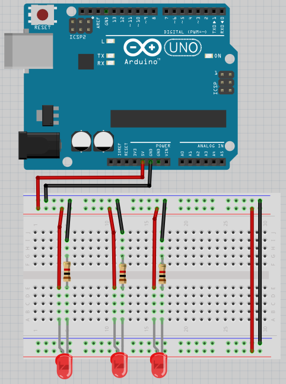
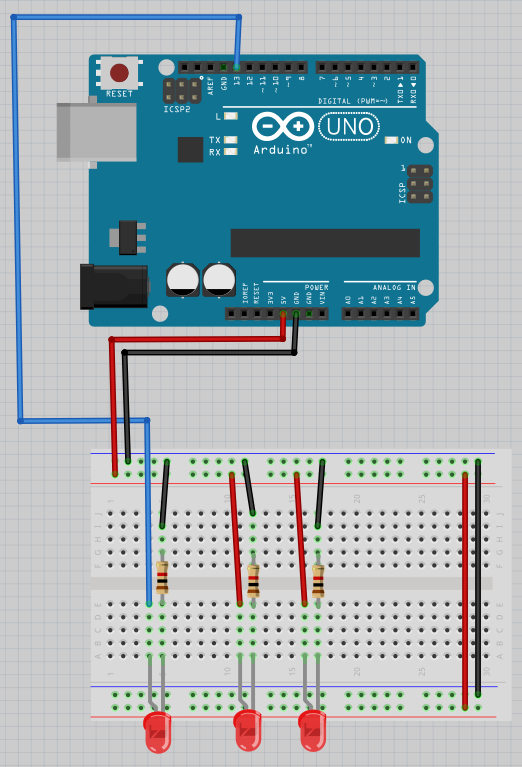
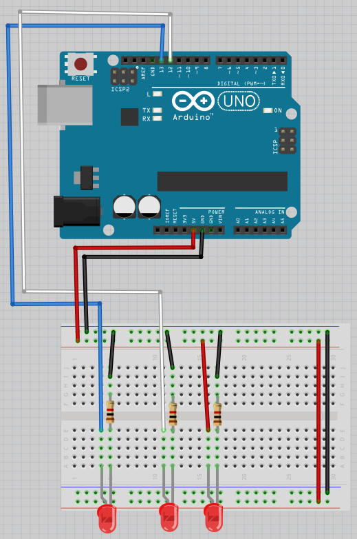

# Lektion 6: Användning av flera lysdioder

Under den här lektionen ska vi ansluta flera lysdioder till en Arduino!

## 6.1: Anslutning

Bygg upp den här kretsen:



Alla lysdioder skulle lysa. Om inte, fråga hjälp!

\pagebreak

## 6.2: Koden

Uploada den här koden:

```c++
void setup() 
{
  pinMode(11, OUTPUT);
  pinMode(12, OUTPUT);
  pinMode(13, OUTPUT);
}

void loop() 
{
  digitalWrite(11, HIGH);
  digitalWrite(12, HIGH);
  digitalWrite(13, HIGH);
  delay(1000);
  digitalWrite(11, LOW);
  digitalWrite(12, LOW);
  digitalWrite(13, LOW);
  delay(1000);
}
```

Vad gissar du att koden gör? Vad händer? Varför?

### Svar

Koden lyser upp lysdioden på hålor 11, 12 och 13,
väntar en second (dws. tusen millisecond),
släckar alla lysdioden
och väntar en second. 
Efter det blir det uprepad.

Men ingenting händer, för att det finns ingen sladdar i hålorna.

## 6.3: Anslutning

Bygg om till den här kretsen:



Lysdioden på vänster skull blinka. Om inte, fråga om hjälp!

## 6.4: Anslutning

Bygg om till den här kretsen:



Den tå lysdioden på vänster skull blinka. Om inte, fråga om hjälp!

## 6.5: Anslutning

Bygg om till den här kretsen:


Den tre lysdioden på vänster skull blinka. Om inte, fråga om hjälp!

## 6.6: Et nytt monster

Andra koden till den som är här nere:

```c++
void setup() 
{
  pinMode(11, OUTPUT);
  pinMode(12, OUTPUT);
  pinMode(13, OUTPUT);
}

void loop() 
{
  digitalWrite(11, HIGH);
  digitalWrite(12, HIGH);
  delay(1000);
  digitalWrite(13, HIGH);
  digitalWrite(11, LOW);
  delay(1000);
  digitalWrite(12, LOW);
  digitalWrite(13, LOW);
  delay(1000);
}
```

Vad ser du?

### Svar

Monstret upprepar:

 * lysdioden i 11 och 12 lyser
 * en secund händer ingenting
 * lysdioden 13 lyser, lysdioden 11 släcker
 * en secund händer ingenting
 * lysdioden 12 och 13 släcker
 * en secund händer ingenting

## 6.13: Knight Rider monstret

Förbereda kod:

Få nu LEDs lysa i ett 'Knight Rider-mönster': 1-2-3-2. 
Det måste alltid finnas exakt en LED som lyser.

 | Knight Rider var en TV-serie med en talande bil.
:-------------:|:----------------------------------------: 


### Svar

```c++
void setup() 
{
  pinMode(11, OUTPUT);
  pinMode(12, OUTPUT);
  pinMode(13, OUTPUT);
}

void loop() 
{
  digitalWrite(11, HIGH);
  delay(1000);
  digitalWrite(11, LOW);
  digitalWrite(12, HIGH);
  delay(1000);
  digitalWrite(12, LOW);
  digitalWrite(13, HIGH);
  delay(1000);
  digitalWrite(13, LOW);
  digitalWrite(12, HIGH);
  delay(1000);
  digitalWrite(12, LOW);
}
```


## 6.13: Slutuppgift

Försammla:

 * 1 dator
 * 1 Arduino
 * 1 USB sladd
 * 1 kopplingsdäck
 * 3 1.000 Ohm motstånd
 * 3 lysdiod
 * tillräckligt mycket sladdar

På dator: har redo koden!

Läs slutuppgift först, för att du har 10 minuten.

1. Fråga någon för att examinera. Den där person får inte hjälpa dig!

Start en timer och gör följande:

2. Bygg upp kretsen från början, uploada koden och visar Knight Rider monstret!
