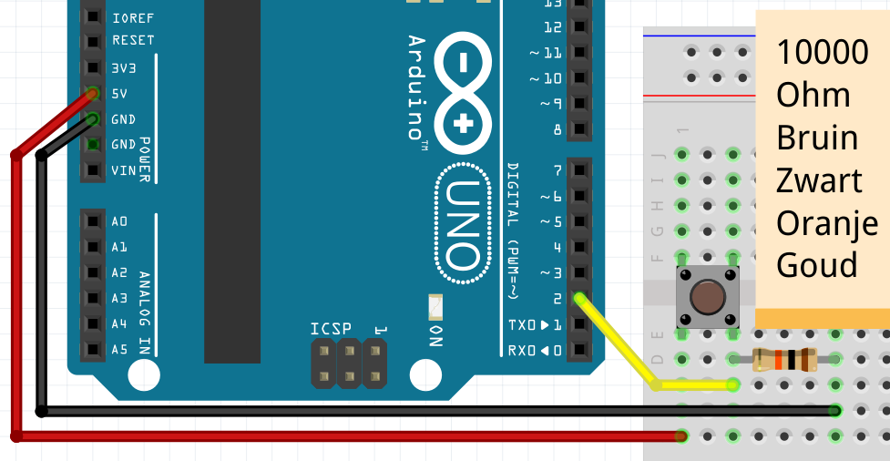

# Lektion 6: Laddningsknapp

I den här lektionen kommer vi att använda en knapp, lysdioder och en funktion som returnerar ett värde.

## 6.1 Laddningsknapp: Hej kommando

 * Du behöver inte ansluta någonting!
 * Ladda upp denna kod:

```c++
const int wachttijd = 1000;

void setup()
{
  Serial.begin(9600);
}

void loop()
{
  Serial.println("Hoi");
  delay(wachttijd);
}
```

†
 * Efter uppladdning, klicka på "Serial Monitor"


Vad ser du?

## 6.2 Laddningsknapp: Hej, lösning

Du ser Arduino säga "Hej"!


## 6.3 Ladda knapp: `wait_effe` och `show_button_see`, kommando

 * Skriv en funktion `wait_effe`: i denna funktion väntar Arduino
   "väntetid" millisekunder
 * Skriv en funktion `show_button_see`: i denna funktion säger
   Arduino (fortfarande) "Hej"
 * Använd `show_button_see` och sedan `wait_effe` i `loop`

## 6.4 Laddningsknapp: `wait_effe` och `show_button_see`, lösning

```c++
// ...

void setup()
{
  // ...
}

void laat_knop_zien()
{
  Serial.println("Hoi");
}


void wacht_effe()
{
  delay(wachttijd);
}

void loop()
{
  laat_knop_zien();
  wacht_effe();
}
```


## 6.5 Laddningsknapp: Knapp, Kommando

 * Anslut en knapp till stift 2
 * Skapa variabel 'pin_button'
 * I "setup", säg med "pinMode" att "pin_button" är en "INPUT"
 * Ersätt `show_button_see` med denna kod:

```c++
void laat_knop_zien()
{
  if (digitalRead(pin_knop) == HIGH)
  {
    Serial.println("Knop is ingedrukt");
  }
}
```

##6.6 Laddningsknapp: Knapp, lösning



```c++
// ...
const int pin_knop = 2;

void setup()
{
  // ...
  pinMode(pin_knop, INPUT);
}

void setup()
{
  // ...
}

void laat_knop_zien()
{
  if (digitalRead(pin_knop) == HIGH)
  {
    Serial.println("Knop is ingedrukt");
  }
}

void loop()
{
  // ...
}
```

## 6.7 Laddningsknapp: släppknapp, kommando

 * I `show_button_show`, om knappen inte är nedtryckt, visa
   Arduino säg sedan "Knappen inte nedtryckt"
 * Ändra "väntetid" till 100 millisekunder

## 6.8 Laddningsknapp: släppknapp, lösning

```c++
const int wachttijd = 100;
// ... [variabele pin_knop]

// ...

void laat_knop_zien()
{
  if (/* de knop is ingedrukt */)
  {
    // ... [zeg dat de knop is ingedrukt]
  }
  else
  {
    Serial.println("Knop is niet ingedrukt");
  }
}
```

## 6.9 Ladda knapp: `nummer,` kommando

 * Skapa en variabel `nummer`. Detta är ett heltal som kan ändras,
   med initialt värde noll
 * Skapa en ny funktion, `show_number_display`. I denna funktion,
   värdet på "nummer" som skickas till den seriella monitorn.
   Du programmerar detta med:

```
Serial.println(aantal);
```

 * Använd `show_button', sedan `show_number' och sedan `wait_effe` i `loop`

## 6.10 Ladda knapp: `nummer`, lösning

```c++
// ...
int aantal = 0;

void laat_aantal_zien()
{
  Serial.println(aantal);
}

void loop()
{
  // ...
  laat_aantal_zien();
  // ...
}
```

## 6.11 Uppladdningsknapp: `svara_på_knapp`, kommando

 * Skapa en ny funktion, "svara_på_knapp".
   I `svara_på_knapp`: om knappen trycks ned,
   blir `nummer` 1 till. Du programmerar detta med:

```
aantal = aantal + 1;
```

 * Använd `reagera_på_knapp` mellan `show_button` och `show_number`
   i `loop`


## 6.12 Lösning

```c++
void reageer_op_knop()
{
  if (digitalRead(pin_knop) == HIGH)
  {
    aantal = aantal + 1;
  }
}

void loop()
{
  // ...
  reageer_op_knop();
  // ...
}
```

## 6.13: Slutuppgift

 * I `svara_på_knapp`: om knappen släpps blir `nummer` noll igen
 * Anslut en lysdiod till stift 13
 * Lysdioden tänds endast när `nummer` är mer än tio. Använd detta `if`-sats:

```c++
if (aantal > 10)
{
  // ...
}
```
