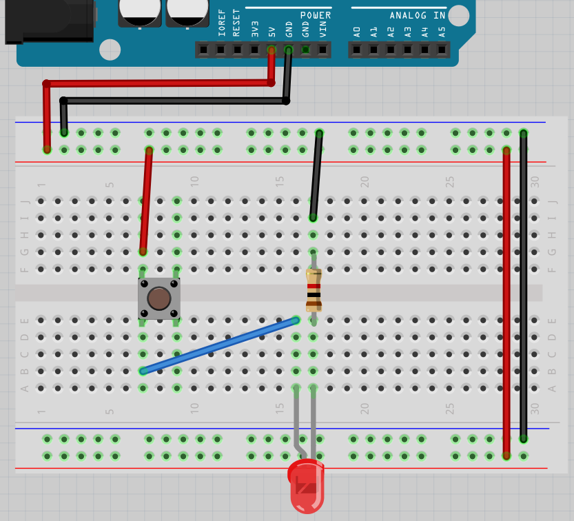
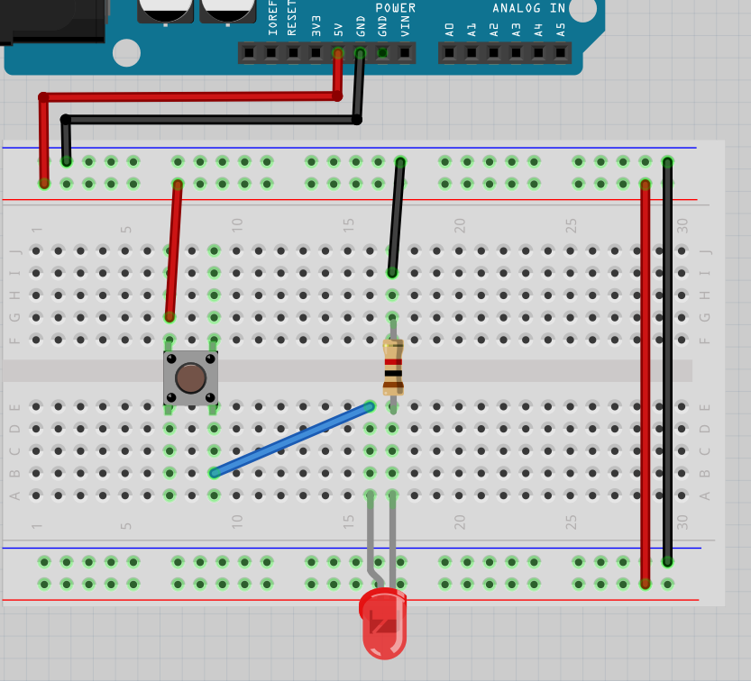

# Lektion 7: Anslutning av en knapp

Under den här lektionen ska vi ansluta en knapp till en Arduino!

## 7.1. Anslut lysdioden och knapp

Bygg den här kretsen:

 * Koppla ur USB-kabeln från datorn, så att Arduino inte längre har ström
 * Montera kretsen enligt bild
 * Sätt tillbaka USB-kabeln i datorn

 | Det böjda benet i ritningen symboliserar det längre benet på en lysdiod
:-------------:|:----------------------------------------: 

Lyser lysdioden? Går knappen nåt? Varför tror du det?

Bygg ihop kretsen och kontrollera!

### Svar

Elen kan gå från `5V` till 5 voltskraftrems, igenom lysdioden och motståndet,
till jordenskraftrems och till `GND`.

Så ja, lysdioden lyser! Om inte, fråga om hjälp!

Knappen, dock, gör ingenting: om du trycker den eller inte gör det ingen skillnad.

\pagebreak

## 7.4. Krets 2

Kolla på den här kretsen:

Nu är knappen användt! 

Lyser lysdioden? Går knappen nåt? Varför tror du det?

Bygg ihop kretsen och kontrollera!

### Svar

Lysdioder kommer alltid att lysa: den vänstra ben av knappen är sammanlänkat!

Så ja, det funkar! Om inte, fråga om hjälp!

## 7.4. Krets 3

Kolla på den här kretsen:

Nu är knappen användt! 

Lyser lysdioden? Går knappen nåt? Varför tror du det?

Bygg ihop kretsen och kontrollera!

### Svar

Lysdioder kommer alltid att lysa: den vänstra ben av knappen är sammanlänkat!

Så ja, det funkar! Om inte, fråga om hjälp!

## 7.6. Slutuppgift

Försammla:

 * 1 dator
 * 1 Arduino
 * 1 USB sladd
 * 1 kopplingsdäck
 * 7 1.000 Ohm motstånd
 * 7 lysdiod
 * tillräckligt mycket sladdar

1. Fråga någon för att examinera. Den där person får inte hjälpa dig.

Start en timer på 10 minuten och gör följande:

2. Får 7 lysdioden att lysa
