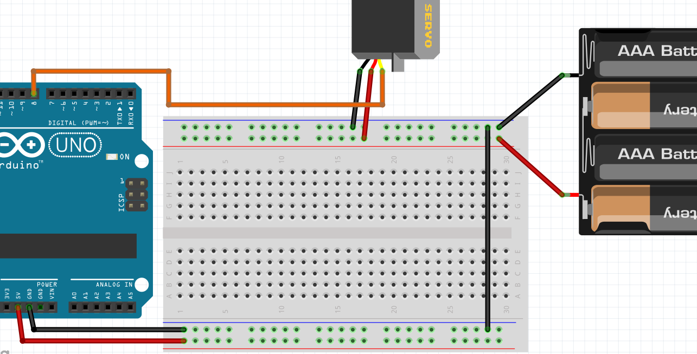

# 16. Fler servomotorer

I den här lektionen ska vi koppla ihop fler servomotorer.
Vi behöver också batterier för detta

## Batteridriven servomotor med seriell monitor

### Anslut

Anslut en servomotor till batteriet enligt bilden 'Servomotor på batteri med seriell monitor'.



 | Glöm inte att ansluta GND på batterierna till GND på Arduino.
:-----------------:|:---------------------- ------- :

 | Kom ihåg att det finns en lucka i mitten av de långa linjerna
:-----------------:|:---------------------- ------- :

\sidbrytning

### Kod

```c++
#include <Servo.h>

Servo my_servo;

void setup()
{
  Serial.begin(9600);
  my_servo.attach(9);
}

void loop()
{
  if (Serial.available())
  {
    const int nummer = Serial.parseInt();
    Serial.print("Jag ställer in servo till ");
    Serial.println(nummer);
    min_servo.write(nummer);
    fördröjning(1000);
  }
}
```

 | Har du glömt vad detta gjorde? Se lektion `3. servo`
:-----------------:|:---------------------- ------- :

## Uppgift 1

 1. Ta reda på servots lägsta och högsta värde

\sidbrytning

## Lösning 1

 1. Ha, det kan du ta reda på själv :-)

## Servomotor på batteri med knapp

### Anslut

Koppla nu in en tryckknapp, såsom figuren 'Servomotor på batteri med knapp'.


\sidbrytning

### Kod

Denna kod låter servo svara på knappen:

```c++
#include <Servo.h>

Servo my_servo;

void setup()
{
  my_servo.attach(8);
  pinMode(A0, INPUT);
}

void loop()
{
  if (analogRead(A0) < 512)
  {
    my_servo.write(45); //Minsta värde
  }
  annan
  {
    my_servo.write(135); //Maximalt värde
  }
  fördröjning(100);
}
```

### Uppgift 1

 * Justera koden så att servo rör sig perfekt

\sidbrytning

### Lösning 1

Samma kod, förutom:

  * 45:an har ersatts av servos minimivärde
  * 135:an har ersatts av servos maximala värde

## Batteridrivna servomotorer med knapp

### Anslut

Anslut nu en extra servomotor, som figuren 'Servomotorer på batteri med knapp'.


### Övning 2

 1. Ta reda på det minsta och högsta värdet på den nya servo
 2. Ändra koden så att båda servon rör sig perfekt *motsatt*.
    Så när knappen släpps är en servo inställd på minimum och den andra på maximum.
    När knappen trycks in växlar den

\sidbrytning

### Lösningar 2

 1. Detta kan göras genom att använda den första koden igen.
    Du kan justera stiftet på servo i koden,
    eller sätt in servot tillfälligt i stiftet på den första servo
 2. Se den här koden:

```c++
#include <Servo.h>

Servo my_servo_1;
Servo my_servo_2;

void setup()
{
  my_servo_1.attach(8);
  my_servo_2.attach(9);
  pinMode(A0, INPUT);
}

void loop()
{
  if (analogRead(A0) < 512)
  {
    my_servo_1.write( 45); //Minsta värde 1
    my_servo_2.write(125); //Högsta värde 2
  }
  annan
  {
    my_servo_1.write(135); //Högsta värde 1
    my_servo_2.write( 35); //Minsta värde 2
  }
  fördröjning(100);
}
```

## Slutuppgift

Anslut nu en andra knapp.
När den första knappen trycks in ska den första servo gå till maximalt läge.
Om *även* den andra knappen trycks in bör den andra servo gå till maximalt läge.

 | Tips: använd ett "om" i ett "om".
:-----------------|:----------------------- -------:
