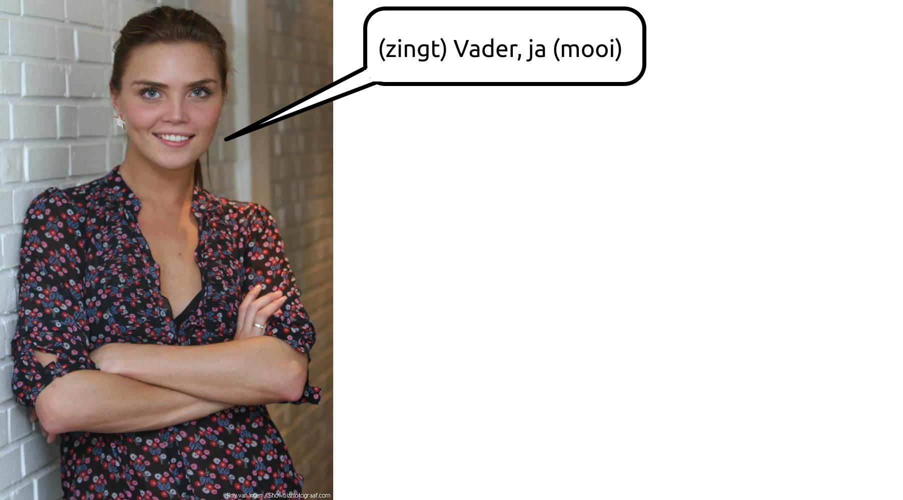
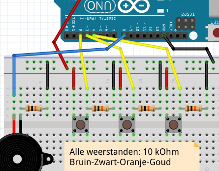
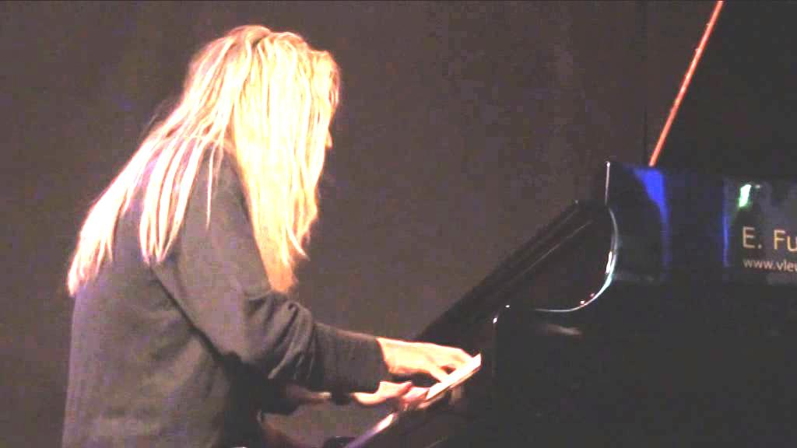

# Lektion 18: 7-stifts piano

I den här lektionen ska vi göra ett enkelt piano som använder 7 stift.


\pagebreak

## Lektion 18: 7-stifts piano: Uppgift 1

Anslut figuren 'A pin'.


Sätt den här koden på din Arduino:

```c++
const int speaker_pin = 8;
const int pin_1 = 2;

void setup()
{
  pinMode(speaker_pin, OUTPUT);
  pinMode(pin_1, INPUT);
}

void loop()
{
  if (digitalRead(pin_1) == LOW)
  {
    tone(speaker_pin, 175, 250);
    delay(250);
  }
}
```

Vi gör ett piano. Detta är den första tangenten med en tonhöjd på 175 Hertz.
Men det finns ett fel i koden! Fixa koden.

\pagebreak

## Lektion 18: 7-stifts piano: Lösning 1

```c++
const int speaker_pin = 8;
const int pin_1 = 2;

void setup()
{
  pinMode(speaker_pin, OUTPUT);
  pinMode(pin_1, INPUT);
}

void loop()
{
  if (digitalRead(pin_1) == HIGH)
  {
    tone(speaker_pin, 175, 250);
    delay(250);
  }
}
```

 | Ah, 'digitalRead' ska vara 'HIGH' istället för 'LOW'!
:-------------:|:----------------------------------------: 

 | Om koden *fungerade*, vände du GND och 5V
:-------------:|:----------------------------------------: 

\pagebreak

## Lektion 18: 7-stifts piano: Uppgift 2

Bygg en andra nyckel på stift 3.
Den behöver också ett eget motstånd.
Detta bör ha en tonhöjd på 196 Hertz.

 | Att bygga en andra knapp är precis som den första
:-------------:|:----------------------------------------: 

 | Koden för den andra knappen går också som den första
:-------------:|:----------------------------------------: 

\pagebreak

## Lektion 18: 7-stifts piano: Lösning 2


```c++
const int speaker_pin = 8;
const int pin_1 = 2;
const int pin_2 = 3;

void setup()
{
  pinMode(speaker_pin, OUTPUT);
  pinMode(pin_1, INPUT);
  pinMode(pin_2, INPUT);
}

void loop()
{
  if (digitalRead(pin_1) == HIGH)
  {
    tone(speaker_pin, 175, 250);
    delay(250);
  }
  if (digitalRead(pin_2) == HIGH)
  {
    tone(speaker_pin, 196, 250);
    delay(196);
  }
}
```

\pagebreak

## Lektion 18: 7-stifts piano: Uppgift 3

Bygg en tredje nyckel på stift 4.
Den behöver också ett eget motstånd.
Nyckeln ska ha en stigning på 220 Hertz.



\pagebreak

## Lektion 18: 7-stifts piano: Lösning 3



```c++
const int speaker_pin = 8;
const int pin_1 = 2;
const int pin_2 = 3;
const int pin_3 = 4;

void setup()
{
  pinMode(speaker_pin, OUTPUT);
  pinMode(pin_1, INPUT);
  pinMode(pin_2, INPUT);
  pinMode(pin_3, INPUT);
}

void loop()
{
  if (digitalRead(pin_1) == HIGH)
  {
    tone(speaker_pin, 175, 250);
    delay(250);
  }
  if (digitalRead(pin_2) == HIGH)
  {
    tone(speaker_pin, 196, 250);
    delay(196);
  }
  if (digitalRead(pin_3) == HIGH)
  {
    tone(speaker_pin, 220, 250);
    delay(196);
  }
}
```

\pagebreak

## Lektion 18: 7-pin Piano: Final Assignment

Gör ett piano med sju tangenter. Se figur 'Frekvenser' för övriga nummer.



